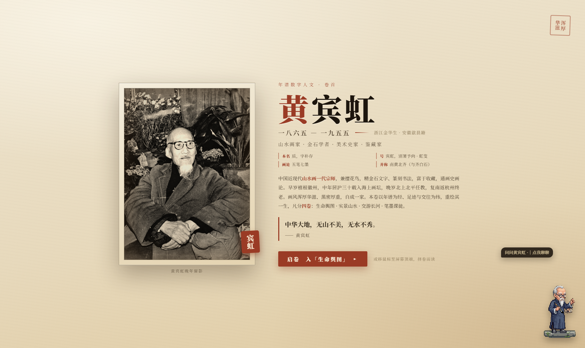
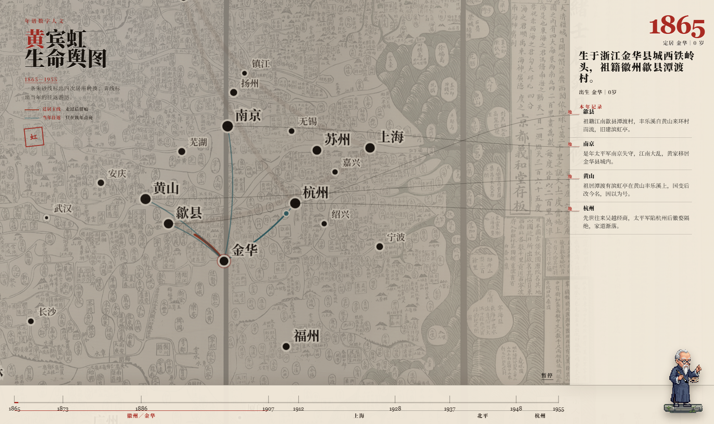
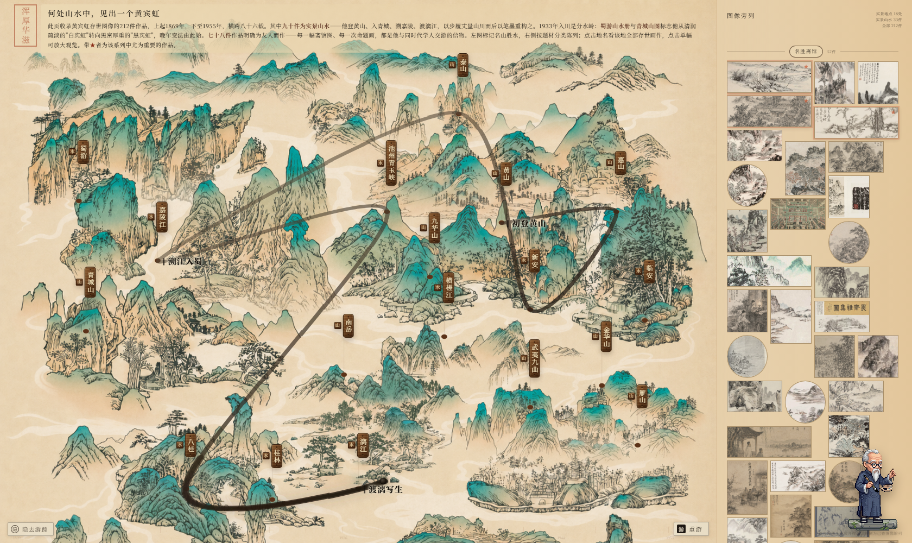
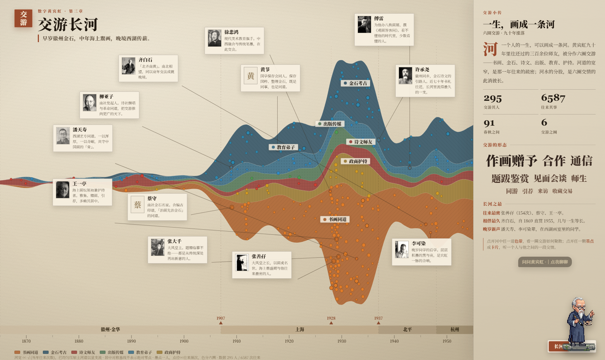
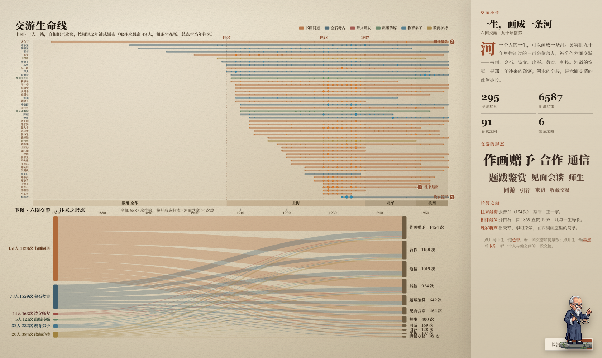
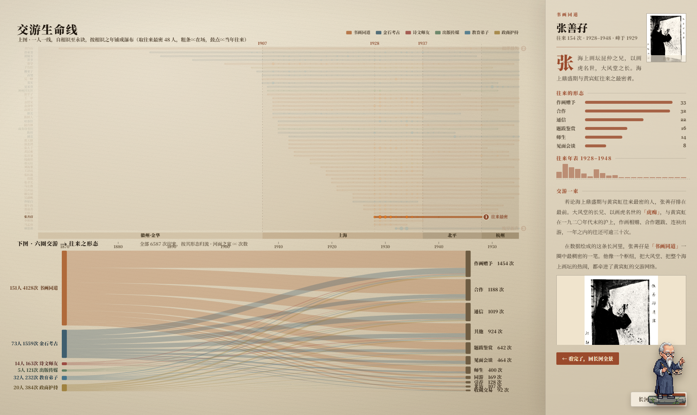
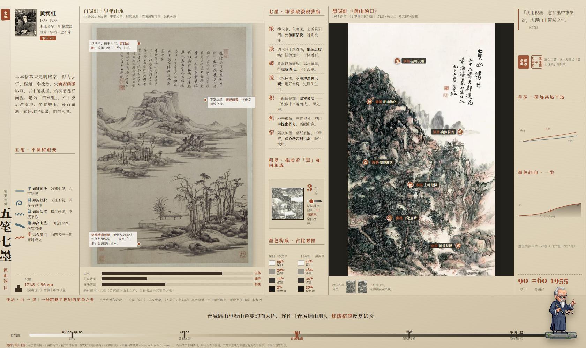

<div align="center">

# 何处山水中，见出一个黄宾虹
### 一卷可交互的「数字人文长卷」 · 黄宾虹年谱可视化

<em>An interactive digital-humanities scroll of the painter Huang Binhong (1865–1955)</em>


-3F5E6E)


</div>

> **这是什么？** 把一部以文字为主、零散难读的《黄宾虹年谱》，重做成一卷**能看、能点、能问**的数字人文长卷。
> 五屏自绘可视化（卷首 · 生命舆图 · 实景山水 · 交游长河 · 五笔七墨）＋一位可对话的 AI 书童「问问黄宾虹」。
>
> **本文采用 VAST Challenge 解决方案的「自问自答」体例**：不堆功能清单，而是沿着*为什么这样设计、一个真实问题如何被一步步看清*的线索，
> 把**数据处理**与**可视化设计思路**讲透。文中所有插图均为本作品实截图。

---

## 目录

1. [问题与挑战](#一问题与挑战)
2. [系统概况](#二系统概况)
3. [数据处理：从年谱文献到结构化证据](#三数据处理从年谱文献到结构化证据)（**重点**）
4. [可视化设计：六个追问](#四可视化设计六个追问)（**重点**）
5. [典型用例走查：「白宾虹」何以变成「黑宾虹」](#五典型用例走查白宾虹何以变成黑宾虹)
6. [设计红线与技术选择](#六设计红线与技术选择)
7. [运行方式](#七运行方式) · [数据与版权](#八数据与版权) · [目录结构](#九目录结构)

---

## 一、问题与挑战

黄宾虹活了九十年（1865–1955），是二十世纪中国山水画的一座高峰。但留给后人的「数据」却极不友好：

- **载体是文字**：一部编年体年谱，几十万字，事件、人物、地名、画作彼此缠绕，读者很难形成整体印象；
- **同一个人有无数名字**：黄质、朴存、予向、虹叟、宾虹……古人一人多号，是结构化的第一道墙；
- **关系是隐性的**：「与傅雷往还」「为某人作画」散落在叙述里，没有一张可计算的关系表；
- **「实景」与「画」的对应被淹没**：他登黄山、入青城、溯嘉陵，再以笔墨重构山川——这条「师造化」的主线，文字读不出来。

> **我们要回答的总问题**：能否把一部年谱，变成一件让普通观众「一眼入境、逐层深读、还能追问」的交互作品？
> 难点不在炫技，而在**两端**——*数据端*要从文本里诚实地抽出可计算的事实，*呈现端*要克制地用水墨语言讲人文故事。

---

## 二、系统概况

作品是**单文件可直接打开**的 `HBH.html`，鼠标移到屏幕顶沿唤出菜单，五屏横向切换；右下角小人是离线 AI 书童。

| 屏 | 名称 | 回答的问题 | 主可视化 |
|---|---|---|---|
| 1 | 卷首 | 定调、入境 | 卷轴开卷 + 谱主立像 |
| 2 | 生命舆图 | 九十年去过哪里？ | 2.5D 水墨地图 + 自动迁徙动画 |
| 3 | 实景山水 | 走过的山 ↔ 画过的画 | 山水底图 + 游迹墨线 + 作品分类陈列 |
| 4 | 交游长河 ⇄ 生命线 | 一生与谁往来、各圈如何消长？ | 主题河流 ⇄ 甘特生命线 + 桑基（组图） |
| 5 | 五笔七墨 | 笔墨语言与「白→黑」变法 | 单屏信息大报 + 白/黑双联 + 积墨滑块 |
| — | 问问黄宾虹 | 任意追问，且不许胡说 | GraphRAG 离线检索问答 |

<div align="center">



**图 1　卷首：以卷轴开卷，奠定「水墨长卷」的基调，而非一块仪表盘。**

</div>

---

## 三、数据处理：从年谱文献到结构化证据

> 这是整件作品的地基。可视化好不好看是表，**数据抽得全不全、对不对**才是里。本节用四问交代全流程。

#### Q1　原始数据长什么样？第一道墙是什么？

原始素材是半结构化的编年年谱文本与作品著录。第一道墙是**指称混乱**：一人多号、同名异人、简繁异写。
若不先归一，后面所有的「人物计数」「交游统计」都会是错的。

**做法 —— 别名归一（entity resolution）**：建立 `alias_map.json`，把 315 组标准名/别号收敛到唯一规范实体
（如 *黄质 / 朴存 / 予向 / 虹叟 → 黄宾虹*）。这一步是后续一切计数的「单位制」。

#### Q2　怎么从叙述文字里抽出「人 / 地 / 作品 / 社团 / 画学概念」和它们之间的事件？

分三类抽取器与一次主题建模，再汇成一张知识图谱：

- `extract_persons.py` / `extract_locations.py`：抽人物与地名，落到规范实体；
- `extract_topics.py`（BERTopic，GPU 离线跑）：把画学议题（如「积墨」「师造化」）聚成概念节点；
- `build_knowledge_graph.py`：组装 **5 类节点（人物 / 地点 / 作品 / 社团 / 画学概念）＋ 4731 条带年份与谱主年龄的关系边**，
  落为 `hbh_knowledge_graph.json`。每条边都锚定 `event_id` 回指年谱原文——*图谱事实*与*文献证据*一一对应。

| 产物 | 文件 | 规模 |
|---|---|---|
| 标准名 / 别号表 | `alias_map.json` | **315** 组 |
| 可考人物 | `hbh_persons.json` | **302** 人 |
| 知识图谱 | `hbh_knowledge_graph.json` | 5 类节点 · **4731** 边 |
| 交游网络（有年份往来） | `hbh_river_data.js` | **295** 人 · **6587** 次往来 · 6 圈 |
| 时代背景轴 | `era_timeline.json` | 4 纪元（徽州→上海→北平→杭州）|

#### Q3　怎么证明「抽全了、抽对了」？（这一步最容易被跳过，也最关键）

> 我们不相信「工具说有 N 个就有 N 个」。**用一个工具的输出去证明它自己，是循环论证。**
> 因此做了一套**正交验证**：人工黄金标准 + 独立复检脚本（`verify_recall.py` v1→v3）交叉比对召回率。

第一轮黄金标准覆盖率仅 **61.6%**——说明漏抽严重。据此**补入 40 位**被遗漏的交游者、修订别名与关系，
再次复检升至 **95.2%**（剩余差额经人工核为同义合并/边界条目，实质≈100%）。这条「验证→补漏→再验证」的闭环，
是数据可信的依据，也是整件作品敢于做交游统计的前提。

#### Q4　结构化数据如何驱动五屏可视化？

一组 `build_*.py` 把同一份事实派生成各屏所需的视图数据，**一处事实、多处呈现**，互不矛盾：

```
年谱文本 ─▶ 别名归一 ─▶ 抽取(人/地/题材) ─▶ 知识图谱(KG) ─▶ 正交验证(95.2%)
                                                   │
        ┌──────────────┬───────────────┬───────────┴────────┬─────────────────┐
   build_journey   build_shanshui   build_river_data    build_viz_data    graphrag/
   (生命舆图)        _atlas(实景)      (交游长河/桑基)       (五笔七墨)        (问问黄宾虹)
```

---

## 四、可视化设计：六个追问

> 每屏只问一个「设计上最该回答的问题」，给出**设计思路**，再走一段**真实用例**。

### 4.1 生命舆图 —— 如何让人「一眼」看懂九十年迁徙，而不是读文字墙？

**设计思路**：第一屏拒绝图表与文字墙。用 **2.5D 水墨地图＋自动迁徙动画**：一支墨笔沿
徽州→上海→北平→杭州自动游走，路过要地时浮出小字与可点击的画作缩影。把「时间」交给动画、把「空间」交给地图，
观众无需阅读即可入境。

**典型用例**：想知道「他中年为什么在上海？」——看墨线在 1907 年后于上海长久盘桓、气泡最密，即知*海上鬻画三十年*是其一生重心。

<div align="center">



**图 2　生命舆图：墨笔自动迁徙，要地浮注可点开画作；以动画与地图替代图表。**

</div>

### 4.2 实景山水 —— 如何呈现「以步履丈量山川，而后以笔墨重构之」？

**设计思路**：左图是他走过的真实山水底图，叠一条**由淡入浓的水墨游迹线**（非纯黑，渐变更显时间流向）；
右栏按题材分类陈列存世作品。把「实景地点」与「为此地所作之画」并置，让「师造化」这条暗线显形。

**典型用例**：点开「青城山」——右栏跳出《青城山图》《蜀游山水册》。结合 1933 年入蜀这一**分水岭**，
观众能直接看到：正是这趟雨中青城之行，触发了他由清润「白宾虹」转向黑密「黑宾虹」的晚年变法。

<div align="center">



**图 3　实景山水：90 件实景作品按地点/题材陈列，游迹墨线渐变铺陈一生行旅。**

</div>

### 4.3 交游长河 ⇄ 生命线 —— 如何刻画 92 年里 6587 次往来的庞大交游？

**设计思路**：交游是多维的（谁、何时、何种关系、密疏）。单图讲不清，故做**可切换的双主视图**：

- **交游长河（主题河流 ThemeRiver）**：六圈交情（书画 / 金石 / 诗文 / 出版 / 教育 / 护持）如六股河水，
  河宽 ∝ 当年往来疏密，直观看「各圈此消彼长」的*洪流感*；
- **交游生命线（甘特 + 桑基，组图）**：一人一条横线，自相识画到永诀，按相识之年排成「瀑布」；
  下方桑基把全部 6587 次往来按形态（作画赠予 / 题跋 / 通信…）归流。回答「谁陪了最久、往来最密」。

**典型用例**：① 在长河点开「书画同道」圈，见其在 1920s 海上期涨成洪峰；② 切到生命线，齐白石那条自 1869 横贯到 1955
一眼夺目（相伴最久），张善孖在海上期明显变粗（往来最密）；③ 点开任一人 → 右栏深读其生平、往来形态、人文小评与配图。

<div align="center">


**图 4　交游长河（主题河流）：六圈交情如六股河水，河宽 ∝ 往来疏密；墨点一人，引线卡片贴岸。**


**图 5　切换为「交游生命线」：甘特式一人一线排成瀑布 ＋ 下方桑基（六圈 ⟶ 往来之形态，全 6587 次）。**


**图 6　点开任一交游者 → 右栏深读：肖像、往来形态柱状、年表、人文「交游小评」与「交游一束」配图。**

</div>

### 4.4 五笔七墨 —— 如何讲清抽象的笔墨语言与「白→黑」变法？

**设计思路**：用**单屏信息大报**承载密集知识：竖排刊名、五笔（平圆留重变）图解、七墨释义、
**白宾虹/黑宾虹双联**横向对照、可拖动的「积墨」滑块（看「黑」如何一遍遍积成），底部一条**变法时间轴**
（师古→贵池→青城坐雨→瞿塘夜游→晚年眼疾），点击节点看各阶段释文。把「看不见的笔墨」变成可读、可玩的图示。

**典型用例**：拖动积墨滑块从 1 遍到 12 遍，亲眼见画面由疏淡入浑厚；再看时间轴，明白「黑密」三四十年代即定、
眼疾只是加速器而非起因。

<div align="center">



**图 7　五笔七墨：单屏密集大报，白/黑双联水平对照 ＋ 积墨滑块 ＋ 变法时间轴。**

</div>

### 4.5 问问黄宾虹（宾翁）—— 如何让观众与谱主「对话」，又不让模型胡说？

**设计思路**：右下角 AI 书童基于**离线 GraphRAG**：

- **结构化关系链（KG）**：把谱主与人物/地点/作品的清洗三元组按「是否涉所问实体 → 关系类型 → 年份接近度」分层召回；
- **非结构化文献（RAG）**：bge 稠密向量 ＋ BM25 词法**混合召回** → `bge-reranker` 交叉编码精排；
- **图→文锚定**：KG 命中边的 `event_id` 强制并入对应年谱原文——*事实*与*证据*相互印证（GraphRAG 的关键一跳）；
- **诚实可标记**：System Prompt 要求「只依据上下文作答、冲突需指出、无据则拒答」，并把关键实体用 `[[人物:傅雷]]`
  标签包裹，供前端高亮联动。检索全程离线，仅最终润色可选调用大模型。

**典型用例**：问「黄宾虹晚年与傅雷的交往？」→ 系统取出 KG 中傅雷相关边（含 1943 八秩画展）＋ 年谱原文证据，
组装提示词后作答，并高亮 `[[人物:傅雷]]`，可一键跳回交游长河中傅雷其人。

---

## 五、典型用例走查：「白宾虹」何以变成「黑宾虹」

> 把五屏当成一套**分析工具**联用，回答一个真实的画史问题——这正是 VAST 解决方案式的「分析过程走查」。

| 步骤 | 用哪一屏 | 看到什么 | 推进的结论 |
|---|---|---|---|
| ① 何时、何地发生转折 | 生命舆图 | 1932–33 墨线西入巴蜀 | 转折与「入蜀」在时空上重合 |
| ② 实景如何触发 | 实景山水 | 点青城山 → 《蜀游册》《青城山图》 | *青城坐雨* 是亲历的视觉契机 |
| ③ 笔墨如何改变 | 五笔七墨 | 积墨滑块 + 变法时间轴 | 由「白·疏淡」转「黑·浑厚」，积墨为核 |
| ④ 谁最早读懂 | 交游长河 | 傅雷条：1943 八秩画展、知音最坚 | 变法的「同代知音」是傅雷 |
| ⑤ 求证与追问 | 问问黄宾虹 | KG＋原文证据作答并高亮 | 结论可回溯到年谱页码 |

**一句话**：观众无需通读年谱，靠「看动画 → 点实景 → 玩积墨 → 读交游 → 问书童」五步，
就能自己把「白→黑变法」的来龙去脉讲清楚——这就是这件作品想达到的「可被使用的人文」。

---

## 六、设计红线与技术选择

- **零图表库**：五屏所有图形（主题河流、甘特、桑基、地图、积墨、时间轴）**全部手绘 SVG/Canvas**，不用 ECharts/D3，
  以求与水墨语言完全统一、像素级可控；
- **统一美学**：矿物国画色 + 宣纸纹理 + 衬线字体 + 人文笔触，无英文界面；
- **诚实**：可视化只呈现数据所见；AI 书童无据拒答；人物配图取自维基共享资源（多为公有领域），仅学习/非商用；
- **可独立运行**：`HBH.html` 双击即看；AI 书童的检索索引离线自包含。

---

## 七、运行方式

**只看长卷（无需后台）**：直接用浏览器打开 `HBH.html`，顶沿唤出菜单切换五屏。

**启用「问问黄宾虹」AI 书童（需 Python 3）**：
```bash
pip install sentence-transformers jieba rank_bm25 numpy   # 一次即可
python graphrag_server.py                                 # 首次约 20s 载入向量模型
# 打开 HBH.html，点右下角小人提问；关闭网页后服务约 12s 自动退出
```
> 离线检索（向量 + 知识图谱）内置于 `graphrag/index`，不需联网；仅最终答案润色可选调用大模型。
> 详见 [`graphrag/README.md`](graphrag/README.md)。

---

## 八、数据与版权

- 文本依据：《黄宾虹年谱》及相关画学文献；时代背景见 `era_timeline.json`。
- 作品/底图：故宫博物院、上海博物馆、浙江省博物馆等公藏，及维基共享资源 / Google Arts & Culture。
- 人物肖像与「交游一束」配图：抓自**维基共享资源**（多为公有领域），统一压至 ≤820px，仅用于学习/非商用。
- 五笔示意线与积墨过程为教学图示，非原作逐笔分层。

---

## 九、目录结构

```
HBH.html                  ── 主作品（五屏，单文件可开）
life_journey.js           ── 生命舆图 / 实景山水 游踪数据
hbh_overview_data.js      ── 生平概览数据
hbh_custom_labels.js      ── 地名/标注
hbh_river_data.js         ── 交游长河 + 生命线 + 桑基 数据（295人/6587往来）
assets/portraits, assets/figs   ── 人物肖像 / 交游一束配图
docs/screens/             ── 本文截图

— 数据处理流水线（源 → 结构化）—
alias_map.json            ── 315 标准名/别号
hbh_persons.json          ── 302 人
hbh_knowledge_graph.json  ── 知识图谱（5类节点 / 4731边）
era_timeline.json         ── 时代背景轴
build_*.py / extract_*.py / verify_recall*.py  ── 抽取·构建·正交验证

— AI 书童（离线 GraphRAG）—
graphrag/                 ── 检索 + 提示词组装（KG＋混合检索＋重排＋图文锚定）
graphrag_server.py        ── 本地服务（前端心跳保活）
```

<div align="center"><sub>布局借信息图编排，释文为教学比附；可视化数据由年谱经上述流水线生成，非杜撰。</sub></div>
